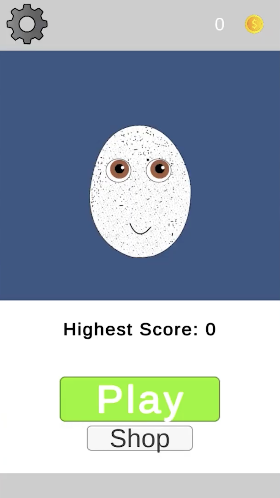

<h1 align="center">Egg Game</h1>

 

<strong>A tilt-controlled jumper about an egg with a face, built in Unity.</strong>

  

  
  
  

 

## What it is

My first larger project — basically Pou's jump minigame taken far more
seriously than it needed to be. Tilt the phone, the egg drifts left and
right, and you climb as high as you can before missing a platform. Built in
2022, entirely by hand, no AI in the loop — figuring out one obscure physics
bug back then could eat a whole afternoon.

It was live on Google Play for a while and later pulled as store policy
around ad SDKs and permissions moved on without it.

## Features

- **Tilt controls** — the accelerometer steers the character, no buttons
- **Screen wrapping** — cross one edge, appear on the other, keeps the climb going
- **Power-ups** — jump-boosting shoes, coin-attracting magnets
- **15 unlockable skins** via a mystery-box system
- **Local progression** — shop state and stats saved/loaded with `JsonUtility`
- **Rewarded ads** (AdMob) for extra coins or an extra life

## Tech stack

- **Unity** (2D)
- **C#**
- Unity's 2D physics + accelerometer input
- `JsonUtility` for local save/load
- Google Mobile Ads SDK (AdMob)
- TextMesh Pro, PlayerPrefs, Particle System

## Running it locally

Open the project folder in **Unity Hub**, then open
`Assets/Scenes/Game.unity` and hit Play. No build server, no env vars — the
AdMob SDK will just log test warnings without a real ad unit ID configured.

## License

MIT — see [LICENSE](./LICENSE). Use it, copy it, change it, ship it, sell it. The only condition is that the copyright notice and license text ride along, and there is no warranty.

That covers my code. Like most Unity projects, this one vendors its
dependencies into `Assets/` — the Google Mobile Ads SDK
(`Assets/GoogleMobileAds/`, `Assets/Plugins/Android/googlemobileads-unity.aar`)
and the External Dependency Manager
(`Assets/Plugins/ExternalDependencyManager/`) are Google's, and they keep their
own licenses.
