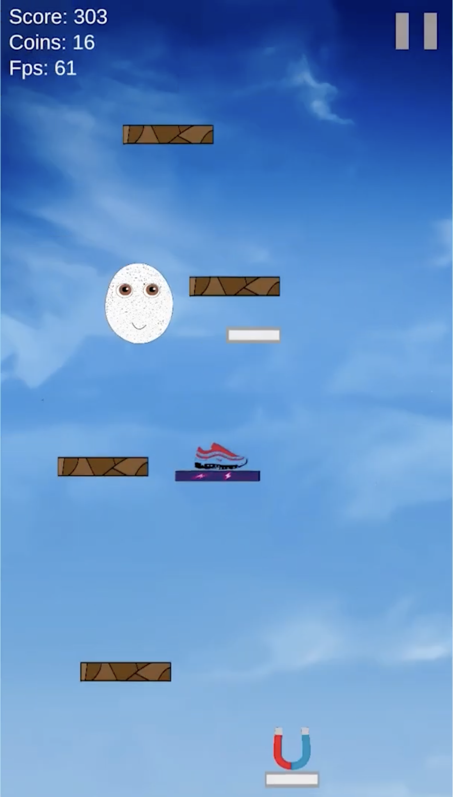

# EggGame

> My first larger project — basically a Pou minigame on steroids. It blends responsive, tilt-controlled 2D physics with an addictive progression loop.


💡 **Note:** Built in 2022. Back before AI, when figuring out an one obscure bug could easily take a whole afternoon :)



---

## ✨ Features

- **Accelerometer Controls** seamlessly guide the jumping character horizontally via device tilt
- **Screen-wrapping mechanics** to keep gameplay fluid when players cross screen borders
- **Dynamic power-ups** including jump-boosting shoes and coin-attracting magnets
- **Unlockable Customization** featuring a mystery box system to unlock up to 15 unique skins
- **Local Progression** automatically serializes and loads shop data and player stats via JSON
- **Rewarded Ads** integrated via Google Mobile Ads SDK (AdMob) to give players extra coins or lives
- **Legacy** — Originally published on Google Play (later removed due to evolving platform policy updates)

<br><br>

## 🧰 Tech Stack

- **Unity** (2D Game Engine)
- **C#** 
- **Unity 2D Physics & Accelerometer API**
- **JsonUtility** (Local Data Serialization)
- **Google Mobile Ads SDK** (AdMob Monetization)
  <br><br>

## 🗂️ Project Structure (example)

```text
Assets/
 ├─ Animations/      # Hand-drawn character & item animations
 ├─ Prefabs/         # Reusable game objects (power-ups, platforms)
 ├─ Scenes/          # Main Menu, Shop, Game Level
 ├─ Scripts/         # C# logic (Physics, AdMob, JSON save/load)
 └─ Sprites/         # 2D artwork and UI elements
